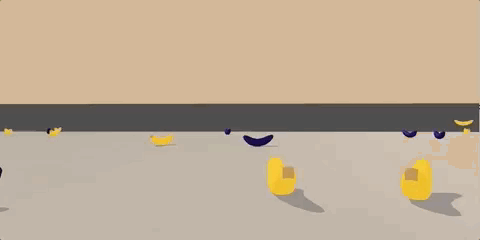
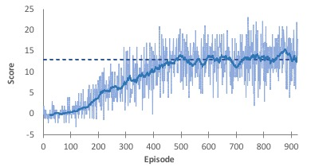

# Deep Q-Network (DQN) Reinforcement Learning using PyTorch and Unity ML-Agents
A simple example of how to implement vector based DQN using PyTorch and a ML-Agents environment.
Project for Udacity Danaodgree in Deep Reinforcement Learning (DRL)

The repository includes the following DQN related files:
- dqn_agent.py -> dqn-agent implementation
- replay_memory.py -> dqn-agent's replay buffer implementation
- model.py -> example PyTorch neural network for vector based DQN learning
- train.py -> initializes and implements the training processes for a DQN-agent.
- test.py -> testes a trained DQN-agent

Code expanded and adapted from code examples provided by Udacity DRL Team, 2018.

The repository also includes Mac/Linux/Windows versions of a simple Unity environment, *Banana*, for testing.
This Unity application and testing environment was developed using ML-Agents Beta v0.4. The version of the Banana environment employed for this project was developed for the Udacity Deep Reinforcement Nanodegree course. For more information about this course visit: https://www.udacity.com/course/deep-reinforcement-learning-nanodegree--nd893

The files in the python/. directory are the ML-Agents toolkit files and dependencies required to run the Banana environment.
For more information about the Unity ML-Agents Toolkit visit: https://github.com/Unity-Technologies/ml-agents

For further details about DQN see: Mnih, V., Kavukcuoglu, K., Silver, D., Rusu, A. A., Veness, J., Bellemare, M. G., ... & Petersen, S. (2015). Human-level control through deep reinforcement learning. Nature, 518(7540), 529.

## Example Unity Environment - Banana's
The example uses a modified version of the Unity ML-Agents Banana Collection example Environment.
The environment includes a single agent, who can turn left or right and move forward or backward.
The agent's task is to collect yellow bananas (reward of +1) that are scattered around a square
game area, while avoiding purple bananas (reward of -1). For the version of Bananas employed here,
the environment is considered solved when the average score over the last 100 episodes > 13. 

### Action Space
At each time step, the agent can perform four possible actions:
- `0` - walk forward 
- `1` - walk backward
- `2` - turn left
- `3` - turn right

### State Spaces 
The agent is trained from vector input data (not pixel input data)
The state space has `37` dimensions and contains the agent's velocity, along with ray-based perception of objects around agent's forward direction.  A reward of `+1` is provided for collecting a yellow banana, and a reward of `-1` is provided for collecting a purple banana. 

## Installation and Dependencies
1. Anaconda Python 3.6: Download and installation instructions here: https://www.anaconda.com/download/

2. Create (and activate) a new conda (virtual) environment with Python 3.6.
	- Linux or Mac:
	
		`conda create --name yourenvnamehere python=3.6`
	
		`source activate yourenvnamehere`

	- Windows:
	
		`conda create --name yourenvnamehere python=3.6`
	
		`activate yourenvnamehere`

3. Download and save this GitHub repository.

4. To install required dependencies (torch, ML-Agents trainers (v.4), etc...)
	- Naviagte to where you downloaded and saved this GitHub repository (e.g., *yourpath/thisgithubrepository*) 
	- Change to the '.python/' subdirectory and run from the command line:
	
		`pip3 install .`
		
## Download the Unity Environment
For this example project, you will not need to install Unity - this is because you can use a version of the Banana's unity environment that is already built (compiled) as a standalone application. 

Download the relevant environment zip file from one of the links below. You need only to download the environment that matches your operating system:

- Linux: [click here](https://s3-us-west-1.amazonaws.com/udacity-drlnd/P1/Banana/Banana_Linux.zip)
- Mac OSX: [click here](https://s3-us-west-1.amazonaws.com/udacity-drlnd/P1/Banana/Banana.app.zip)
- Windows (32-bit): [click here](https://s3-us-west-1.amazonaws.com/udacity-drlnd/P1/Banana/Banana_Windows_x86.zip)
- Windows (64-bit): [click here](https://s3-us-west-1.amazonaws.com/udacity-drlnd/P1/Banana/Banana_Windows_x86_64.zip)

After you have downloaded the relevant zip file, navigate to where you downloaded and saved this GitHub repository and place the file in the main folder of the repository, then unzip (or decompress) the file.

NOTE: The Banana environment is similar to, but not identical to the Banana Collector environment on the Unity ML-Agents GitHub page. 

## Training
 - activate the conda environment you created above
 - change the directory to the 'yourpath/thisgithubrepository' directory.
 - open `train.py`, find STEP 2 (lines 55 to 65) and set the relevant version of Banana to match your operating system.
 - run the following command:
 
 	`python train.py`
	
 - training will complete once the agent reaches *solved_score* in `train.py`.
 - after training a *dqnAgent_Trained_Model_datetime.path* file will be saved with the trained model weights
 - a *dqnAgent_scores_datetime.csv* file will also be saved with the scores received during training. You can use this file to plot or assess training performance (see below figure).
 - It is recommended that you train multiple agents and test different hyperparameter settings in `train.py` and `dqn_agent.py`.
 - For more information about the DQN training algorithm and the training hyperparameters see the included `Report.pdf` file.

 

## Testing
 - activate the conda environment you created above
 - change the directory to the 'yourpath/thisgithubrepository' directory.
 - run the following command:
 
 	`python test.py`
	
 - An example model weights file is included in the repository (*dqnAgent_Trained_Model.pth*).
 - A different model weights file can be tested by changing the model file name defined in `test.py` on line 109.
